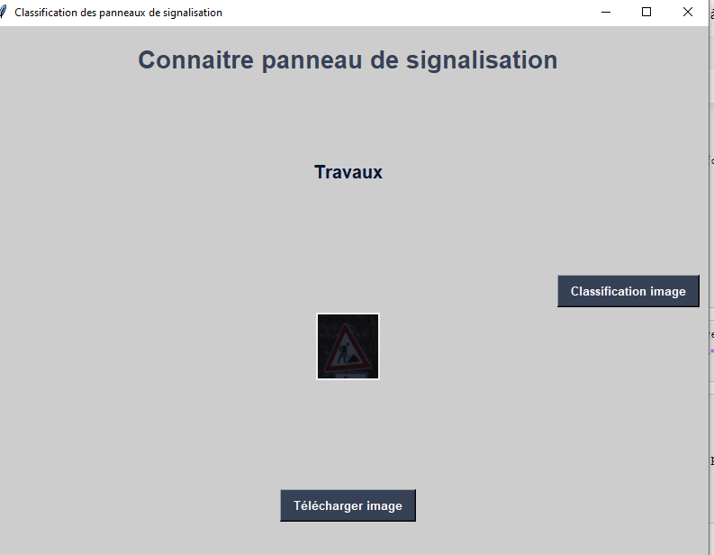
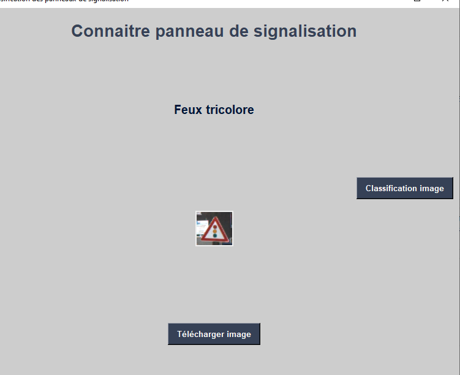

# Détection et reconnaissance des panneaux de signalisation

    But: construire un modèle IA pour la détection et la reconnaissance des panneaux de signalisation sur les images. 
    
Contexte du projet :

Dans le monde de l'IA des grandes entreprises comme Tesla, Uber, Google, Mercedes-Benz, etc. travaillent sur des véhicules autonomes et des voitures autonomes. Pour atteindre la précision de cette technologie, les véhicules doivent être capables d'interpréter les panneaux de signalisation et de prendre des décisions en conséquence. Votre objectif est de construire un modèle qui permet de réaliser cette tâche.

Une interface graphique est demandée:

   Qui permet de détecter dans une image les panneaux de signalisation et les reconnaitre (Afficher le label en Français).

    
Notre notebook se décompose en 2 parties :

- une partie qui permet de classer les panneaux de signalisation
- une seconde partie, l'interface graphique, qui nous permet reconnaitre les panneaux de signalisation

ci dessous le résultat de notre affichage via tkinter  :

